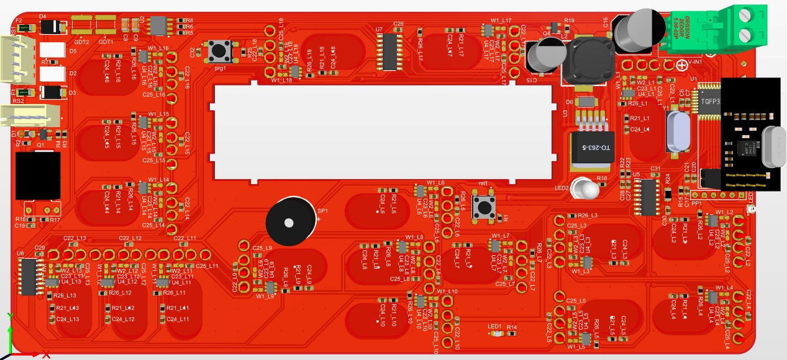
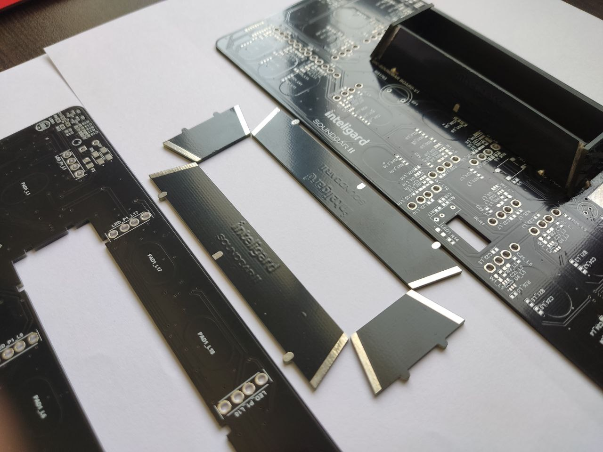
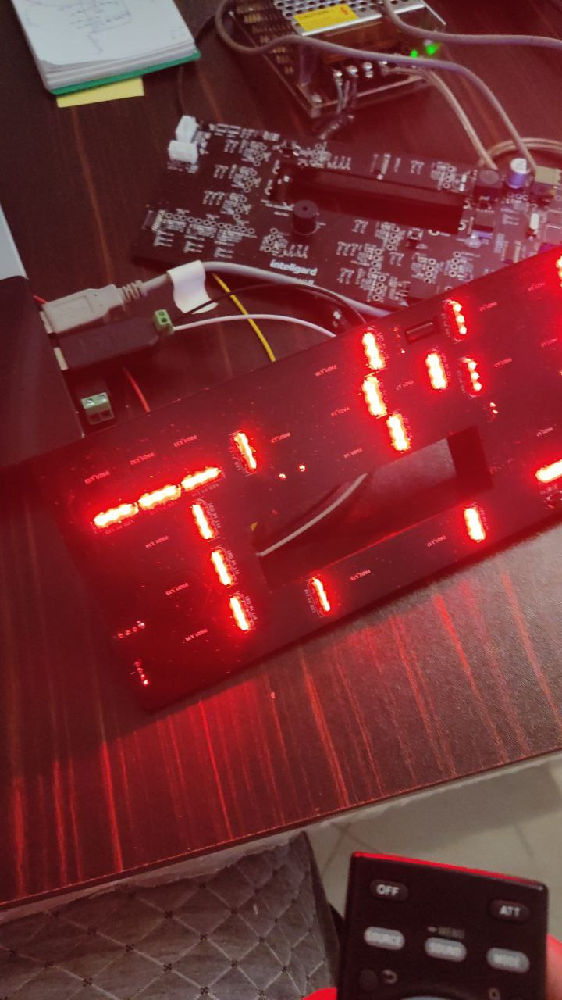

# Sound Bar
The purpose of this project was to design a board to control a sound amplifier module with touch interface. The sound amplifier is controlled by an infrared remote, so the designed board has an infrared LED to send the exact codes to the amplifier module. The board can receive user input via remote control, touch sensors, or RS485 bus.

